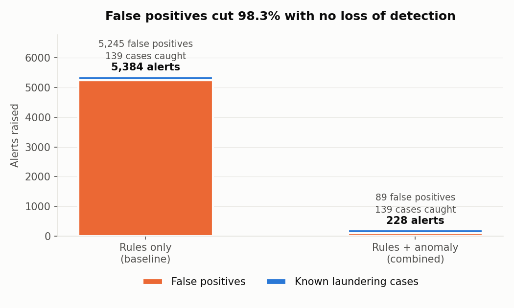
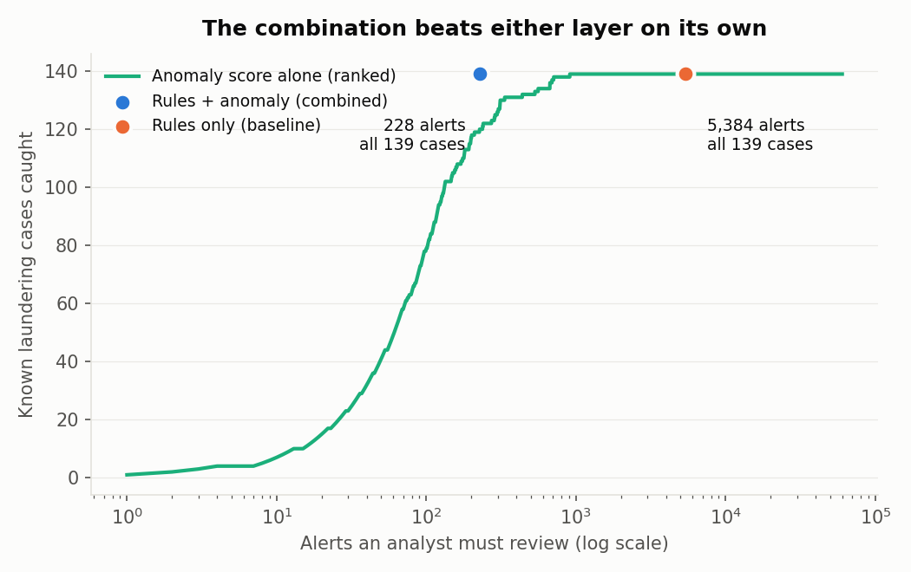
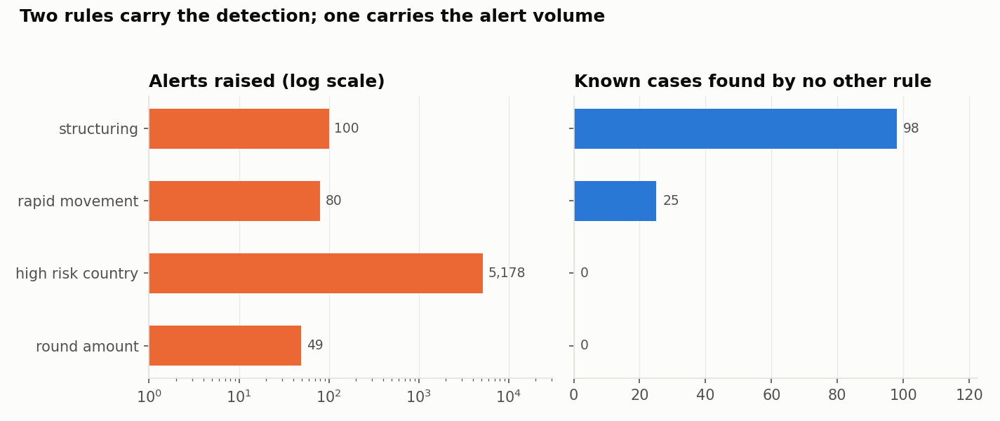
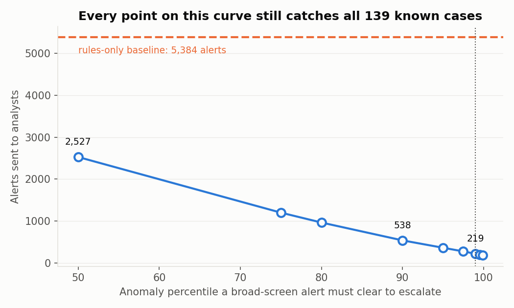
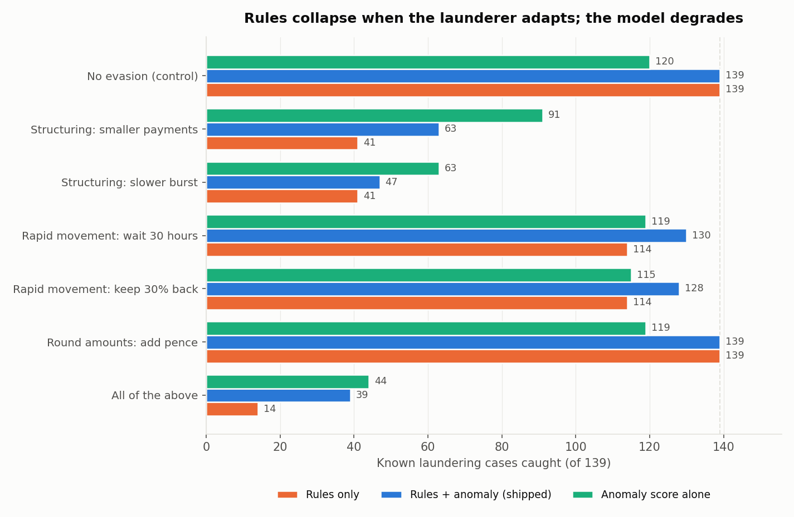

# AML Transaction Monitoring

[](https://github.com/meghajoshi-ds/AML-Transaction-Monitoring/actions/workflows/tests.yml)

A rules-plus-anomaly transaction monitoring system built around the problem that
actually costs banks money: not missed laundering, but the volume of false alarms.

**On 60,059 transactions it cuts false positives by 98.3%, from 5,245 to 89, and
still catches all 139 known laundering cases. Alert precision rises from 2.6% to
61%.** That is about 1,289 analyst-hours a year returned to investigation.

**[Open the interactive analyst queue](https://meghajoshi-ds.github.io/AML-Transaction-Monitoring/)** to filter all 228 alerts
and see the evidence behind each one.



---

## Why false positives are the problem

Every alert a monitoring system raises is read by a compliance analyst. Industry
false-positive rates are widely quoted at 90 to 95%. That figure comes from
vendor and consultancy commentary rather than published supervisory data, so
treat it as an order of magnitude rather than a constant. The direction is not
disputed: most alerts close with no action.

That makes "flag aggressively to be safe" the wrong instinct. It buries real
cases in noise and consumes the hours that should go into investigating them. So
the question here is not whether laundering can be detected. It is how much noise
can be removed without losing a case.

## Results

| | Alerts | Cases caught | False positives | Precision | Recall |
|---|---:|---:|---:|---:|---:|
| Rules only | 5,384 | 139 / 139 | 5,245 | 2.6% | 100% |
| Anomaly model alone, same budget | 228 | 120 / 139 | 108 | 52.6% | 86.3% |
| **Rules + anomaly** | **228** | **139 / 139** | **89** | **61.0%** | **100%** |

Neither layer works alone. The rules find everything and drown the analyst. The
model ranks well but misses 19 cases at the same alert budget.



## Where the false positives came from

Measuring each rule on its own recall hides the problem. The column that matters
is the last one: cases a rule found that no other rule had already found.

| Rule | Alerts | Cases caught | Precision | Found by no other rule |
|---|---:|---:|---:|---:|
| Structuring | 100 | 100 | 100% | **98** |
| Rapid movement | 80 | 40 | 50% | **25** |
| High-risk country | 5,178 | 13 | 0.25% | **0** |
| Round amount | 49 | 2 | 4.1% | **0** |

One rule generated 96% of the alerts and contributed nothing. The
high-risk-country screen raised 5,158 alerts no other rule raised, and found zero
cases the targeted rules had not already caught.



### How the layers combine, and what Tier B costs

Rules are tiered by how specific they are, with the model acting as a
corroborating filter rather than a detector:

* **Tier A, targeted typologies** (structuring, rapid movement). These describe a
  specific laundering behaviour, so they escalate on their own. 179 alerts, 77.7%
  precision, and they catch all 139 cases by themselves.
* **Tier B, broad screens** (high-risk country, round amount). These describe risk
  rather than behaviour, so an alert escalates only if the model also places the
  transaction in the top 1% of the book. 5,224 alerts become 40.
* **Anomaly-only channel**, top 0.1% of anomaly score with no rule firing, for
  typologies no rule describes. 9 alerts.

**Every one of the 40 Tier B alerts is a false positive.** Tier A already catches
all 139 cases, so Tier B cannot contribute a true positive. It can only add
volume. On this data the best-performing configuration is Tier A alone: 179
alerts at 77.7% precision.

I kept Tier B anyway, and the reason is not statistical. Twelve months of
synthetic data showing no laundering through Cyprus is not evidence that none
exists, and a jurisdiction screen carries supervisory expectations that a
precision figure does not capture. Removing a control because it has not fired
yet is how monitoring gaps are created. The corroboration requirement is the
compromise: it keeps the control alive at 40 alerts a year instead of 5,224, and
`metrics.json` reports the Tier A only configuration beside it so the cost of
that caution stays visible.



## What happens when the launderer adapts

Every threshold is a line someone can step around, and these thresholds are
inferable by anyone watching which payments get questioned. So the system was
attacked. Each scenario perturbs only the laundering transactions and re-runs the
full stack. The model is fitted once on the original data and then frozen, as a
bank's would be before the attacker moves.



| Evasion | What it costs the launderer | Rules | Shipped | Model alone |
|---|---|---:|---:|---:|
| No evasion (control) | nothing | 139 | 139 | 120 |
| Structuring: smaller payments | more payments, more accounts | **41** | 63 | 91 |
| Structuring: slower burst | months instead of a week | **41** | **47** | 63 |
| Rapid movement: wait 30 hours | days of exposure per hop | 114 | 130 | 119 |
| Rapid movement: keep 30% back | real value stranded per hop | 114 | 128 | 115 |
| Round amounts: add pence | **nothing** | 139 | 139 | 119 |
| **All of the above** | a patient, informed launderer | **14** | **39** | **44** |

Four things come out of this, and the first two matter more than the headline.

**The rule layer is brittle.** An informed launderer takes it from 139 cases to
14, using nothing more exotic than smaller payments and longer gaps.

**The model degrades where the rules collapse.** It holds 44 under the same attack and beats the rules in every
evasion scenario. It keys on amount shape, velocity and counterparty spread,
properties a launderer has to change their actual behaviour to escape rather than
just a number. This reverses the main result: on static data the rules detect and
the model filters noise, but under adaptation the roles swap.

**The architecture is the weak link, not the model.** Under full evasion the
shipped system catches fewer cases than the model alone at the same alert budget,
because the design gates the model behind rule corroboration. That is right
against noise and wrong against an adversary. The fix is to treat the tiering as a
dial: widen the model-only channel when rule detections fall.

**One rule is free to evade.** Adding pence defeats the round-amount rule
completely and changes the outcome not at all, because the cases it caught were
always caught by something else.

None of this is visible from the 98.3% figure.

## The data

Three files, supplied as part of a self-directed project brief and generated
synthetically for it. The generator is not mine and I cannot attribute it
further than that. Transaction-level AML data is never public, since it is personal
financial data under active supervision, so a synthetic book is the only option
for work like this. The generator produced ordinary retail behaviour plus a small
number of planted laundering patterns at realistic prevalence.

| File | Contents |
|---|---|
| `aml_transactions_raw.csv` | 60,154 transactions, 12 months, GBP |
| `aml_customers.csv` | 3,000 accounts with home country and open date |
| `aml_ground_truth_labels.csv` | 139 distinct known cases, 0.23% prevalence |

The labels are opened in `evaluate.py` and nowhere else, the way a held-out test
set would be.

### Cleaning

Full reasoning for each decision is in [DECISIONS.md](DECISIONS.md), with the
profiling numbers that drove it in `outputs/profile_report.md`.

| Issue | Found | Handling |
|---|---|---|
| Mixed timestamp formats | 3,008 rows `DD/MM/YYYY` | Parsed per subset with explicit formats. Inference misreads days as months, silently |
| Duplicate transaction IDs | 15 | All genuine replays, removed in two passes *after* timestamp parsing |
| Negative amounts | 20 | Quarantined, not deleted. 8 are deposits, so "refund" does not hold |
| Missing `amount` | 60 | Quarantined, unscoreable by any amount rule |
| Missing `sender_country` | 601 | Imputed from the customer file, which agrees 99.79% where both are present |
| Missing `channel` | 1,203 | Filled as `unknown`. A failed feed is information |
| Country name variants | ~2,700 rows | Folded onto 14 canonical names |
| Extreme amounts | 5 above GBP 50k | Kept uncapped. In AML a large transfer is signal, not noise |

### Two leakage traps

Either one would invalidate the whole result.

1. **`transaction_id` encodes the answer.** 101 rows are prefixed `TXNS` for
   structuring and 39 `TXNR` for rapid movement, exactly the 140 labelled rows.
2. **`transaction_type` has an undocumented fifth value.** `wire_transfer` appears
   on precisely the 39 rapid-movement rows. One-hot encoded, that dummy is a
   perfect detector of a planted pattern.

Both are neutralised before modelling. A model holding either scores nearly
perfectly and means nothing.

There is a third trap in the label file: 140 positive *rows* but 139 distinct
positive *transactions*, because one known case is among the 15 replays.
Deduplicating gives the right denominator. Using 140 would have capped reported
recall at 99.3% for no reason.

## Running it

```bash
python -m venv venv && source venv/bin/activate   # Windows: venv\Scripts\activate
pip install -r requirements.txt

python src/run_pipeline.py     # profile, clean, rules, model, evaluate, figures
python -m pytest tests/ -q     # 67 tests
```

The pipeline takes about 20 seconds and regenerates every number and figure here.
`src/adversarial.py` runs the evasion suite separately and takes a few minutes.

### Notebooks or modules?

Both, doing different jobs. The five notebooks in `notebooks/` carry the
analysis: the profiling, the reasoning behind each cleaning decision, how the
rules were calibrated and what the evaluation found. They are committed with
their output, so they can be read on GitHub without running anything.

`src/` holds the same logic as tested modules, because a notebook cannot be unit
tested or put in CI. The notebooks import from `src/` rather than
re-implementing anything, so the numbers in them are the numbers the pipeline
produces. Two bugs found in this project, a latent windowing error and a silent
pandas-version bug, were both caught by tests that could not exist in a
notebook.

## SQL

The rule layer also exists as SQL in [`sql/`](sql/), the way it would run
against a warehouse rather than in a pandas process. `01_structuring.sql` uses
two window functions to find payments inside any qualifying seven-day window,
checking both the sender and beneficiary side.

These are verified, not illustrative: `tests/test_sql.py` asserts each query
returns exactly the same transactions as the corresponding function in
`src/rules.py`, so the two implementations cannot drift. A further test enforces
that no detection query reads the labels table.

```bash
python src/sql_runner.py    # SQLite, ships with Python, nothing to install
```

`04_rule_contribution.sql` computes the project's central finding independently
of the Python:

```
             rule  alerts  cases_caught  precision_pct  alerts_only_this_rule  cases_no_other_rule_found
high_risk_country    5178            13           0.25                   5158                          0
      structuring     100           100         100.00                     98                         98
   rapid_movement      80            40          50.00                     61                         25
     round_amount      49             2           4.08                     44                          0
```

## Reproducibility

Dependencies are pinned in `requirements.txt`, and CI runs the suite on both
pandas 2 and pandas 3, because a version difference here changed the answers
rather than raising an error.

pandas 2 stores timestamps as `datetime64[ns]`, pandas 3 as `datetime64[us]`.
Casting a timestamp column to `int64` therefore returns nanoseconds on one and
microseconds on the other, while `pd.Timedelta(...).value` is always nanoseconds.
Mixing them made every time window 1000x too wide. On pandas 3 the rapid-movement
rule returned zero alerts and structuring over-flagged, with no error anywhere.
All time arithmetic now goes through `src/timeutils.epoch_ns`, and tests assert
identical results under `ns`, `us`, `ms` and `s`.

The model layer can still drift by a couple of false positives across
scikit-learn versions, since Isolation Forest's sampling depends on the
implementation. The rule-layer numbers are exact.

## Repo structure

```
├── data/                   the three source files
├── notebooks/              the analysis, readable without running anything
│   ├── 01_explore.ipynb        profiling, and both leakage discoveries
│   ├── 02_clean.ipynb          every cleaning decision with its evidence
│   ├── 03_rules.ipynb          the four typologies and their calibration
│   ├── 04_ml_layer.ipynb       features, no-lookahead, Isolation Forest
│   └── 05_evaluate.ipynb       metrics, tiering, the unique-contribution finding
├── src/
│   ├── config.py           paths, reporting threshold, high-risk list
│   ├── timeutils.py        datetime-unit normalisation
│   ├── profiling.py        profile before fixing anything
│   ├── cleaning.py         cleaning and quarantine
│   ├── rules.py            one function per typology
│   ├── ml_layer.py         trailing-window features, Isolation Forest
│   ├── evaluate.py         metrics, tiering, case list
│   ├── adversarial.py      evasion testing
│   ├── sql_runner.py       loads the book into SQLite and runs sql/
│   ├── figures.py          charts
│   ├── build_dashboard_data.py   evidence strings for the queue
│   └── run_pipeline.py     runs all of it
├── sql/                    the rules as SQL, verified against the Python
├── docs/index.html         the dashboard, served by GitHub Pages
├── tests/                  67 tests, including SQL/pandas equivalence
├── outputs/                results, figures, the analyst queue, the dashboard
├── requirements.txt
└── DECISIONS.md            the reasoning behind every judgement call
```

## The analyst queue

`outputs/case_management.csv` is what an analyst would work from. Each row
carries the reason it surfaced rather than just a score: which rules fired, which
channel escalated it, its anomaly percentile, and a priority.

## Method notes

* **Unsupervised by design.** A classifier trained on 139 labels would score
  brilliantly and be useless. Real banks have no trustworthy transaction-level
  laundering labels, only closed alerts, most of them no-further-action.
* **The model cannot see country risk**, even though including it would improve
  its standalone score. That signal already has a rule. Keeping it out is what
  makes the two layers fail independently, and independence is the only reason
  corroborating one against the other adds information.
* **No lookahead.** Account statistics use expanding windows shifted by one row,
  so a transaction is scored only against what its account did before it.
  Computing them over the full year inflated the anomaly layer by about 17
  alerts' worth of hindsight. See [DECISIONS.md](DECISIONS.md) entry 16.
* **Structuring is checked on both sides.** Profiling the GBP 9k to 10k band
  showed beneficiary accounts receiving 10 to 12 near-threshold payments while no
  sender exceeded 4. That is funnelling, not self-structuring, and a sender-only
  rule misses most of it.

## Limitations

* **The 98.3% figure is specific to this rule set.** It is largely the story of
  one badly calibrated jurisdiction screen. A bank with better-tuned rules would
  see a smaller reduction. The method generalises, the number does not.
* **The combination threshold is calibrated against the labels.** In production it
  would be calibrated on historical investigated alerts, with drift expected.
* **Synthetic data.** These patterns sit still. The evasion testing is the closest
  available substitute for an adapting adversary, but it is still me choosing how
  the launderer adapts.
* **100% recall means 100% of the known cases.** Anything the generator did not
  plant cannot be measured, and the real false-negative rate is unknowable here,
  as it is in production.
* **No account-level or network view.** Detection is transaction-level. Real
  typologies such as layering chains and circular flows live in the graph between
  accounts.

## With more time

1. **Network analysis.** Build the account graph and look for cycles and layering
   chains. The funnel structure found in the structuring band is already a graph
   pattern being detected one transaction at a time.
2. **Account-level risk scoring**, so a mule is scored as an entity rather than as
   a series of individually unremarkable transfers.
3. **Act on the evasion findings.** Build an adaptive tier that widens the
   model-only channel when rule-layer detections fall, so the system rebalances
   toward behaviour when thresholds stop working.
4. **Feedback loop.** Capture analyst dispositions and use closed alerts to
   retrain the corroboration threshold, which is how this would be maintained in
   practice.
